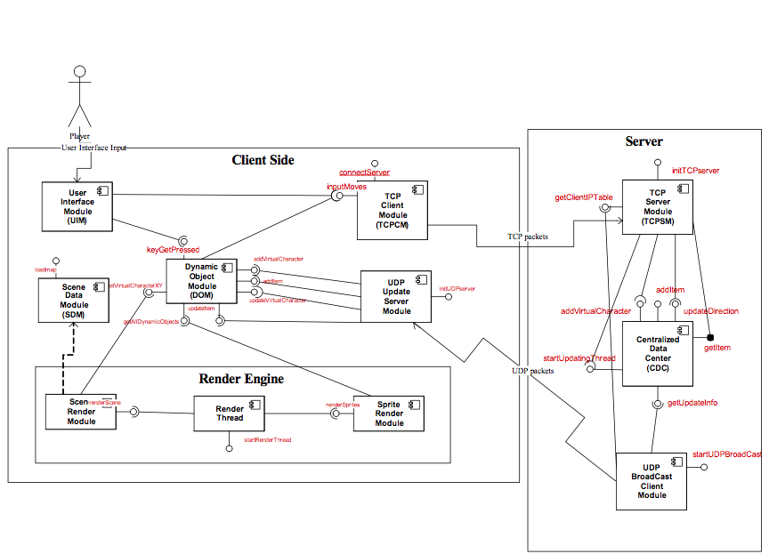
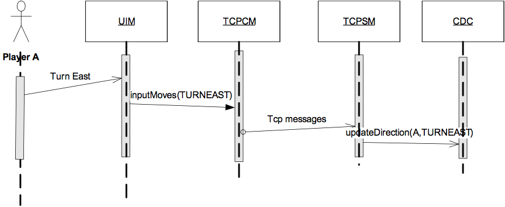
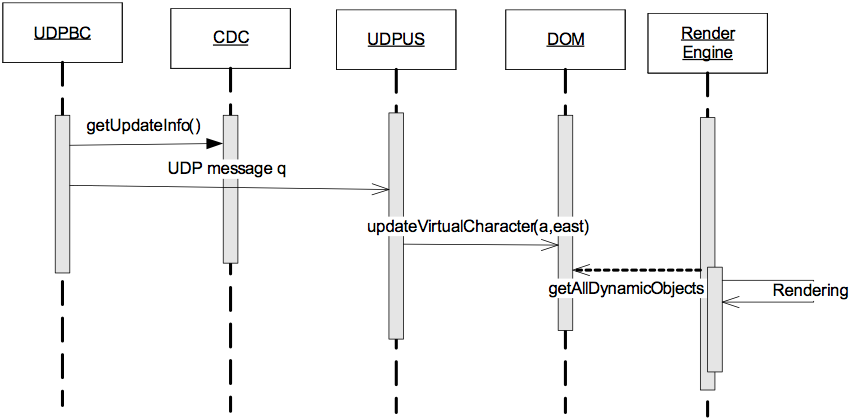

Organ-Donation
======
## Description
玩家可以藉由方向鍵操作人物往東西南北移動
玩家可以看見其他玩家在畫面上移動的位置



## Module 名字簡寫

* TCP Client Module (TCPCM)
* TCP Server Module (TCPSM)
* User Interface Module (UIM)
* Dynamic Object Module (DOM)
* Scene Data Module (SDM)
* Scene Render Engine (SCENERE)
* Sprite Render Engine (SPRITERE)
* UDP broadcast client (UDPBC)
* UDP update server (UDPUS)
* Centeralized Data Center (CDC)

## 另外有兩張清楚的架構圖，請上網抓取

### 模組分配
以下幾頁是每個模組 **包裝** 後與其他模組互動的模組界面 (module interface)。請將你的prototype 進一步包裝成具有模組界面的模組（如何在Java 包裝模組，請參考上課內容），請然後自行設計所謂的模組測試（testing bench）環境來測試你的模組功能正確性與完整性。

   本次module programming 工作分割與上次相關，關連如下圖
* protype A  ->  UI Module + CDC
* protype B  ->  TCPSM + TCPCM
* protype C ->  UDPBC + UDPUS
* protype D ->  SPRITERE + DOM
* protype E ->  SCENERE + SDM

為了完成這個程式作業，你必須先看懂下一頁開始的設計文件。以下還有幾個重點：

**重點1：包裝完成後，請用Java 的 package 功能將你的模組包裝成別人可以容易引用的package。以及使用 singleton 的方式來包裝你的模組，關於 package 的功能，請詳讀Java 書籍**

**重點2：DEMO 當天，為了展示你的模組可以工作，你必須自行撰寫模組測試環境（test bench）這部分的分數將佔你的DEMO成績的百分之40。請準備足夠的test case，並且一一DEMO給助教看以證明你的模組能夠正常的工作於每一種test case。何謂test driver environment老師會於課堂上做解說。**

**重點3：你的程式必須做足夠的defensive programming（assertion）。請準備足夠的錯誤的test cases 來證明你的模組可以應付不良的呼叫,隔絕可能的錯誤於你的模組之外。**

**重點4：當你在實做你的模組時，無法避免的，你也必須瞭解與你模組互動的模組的大概功能，以進行測試環境的實做。**

        **請注意，本文件描述的模組界面，只具備最基本的功能，以方便各位同學統一實做作為第二階段的個人成績。為了能夠有統一標準，有些介面與功能應該不足於你們project 所需。不過在第二階段的DEMO，你只要實做這些最基本的模組功能即可。未來你們必須擴充，新增模組或者修改既有的模組界面(例如增加參數)，以符合你們project的需求。**

1. 1.

# Design Document

Verson 3.0

Author:  Jeffery Cheng

Last updated: 2007/6/20


1. **Section 1.** 系統架構與設計原理。

本節描述的模組設計，能夠應付網路連線中，每個玩家控制的角色進行地圖中，上下左右的移動。以及在移動的地圖中，讓玩家去擷取某個寶物。

一般網路遊戲設計的方式，都會有一台server 主機負責同步彼此玩家之間的資料。這部server 主機可以由開局的玩家扮演。也可以是一台獨立的server 主機。在遊戲開始的時候，連到該server 主機的電腦我們則稱為client 端。

在這個設計中，所有玩家的資料，包括行進方向，速度等等都是保留在伺服器端的CDC (Centralized Data Center) 中。當任何一個玩家進行了狀態的改變，例如行進方向的改變，都會啟動一連串的動作，將該狀態的改變傳送到伺服器端（採用TCP，因為不能遺失），更改CDC當中的資料。

每隔1/5 到1/10 秒，server 主機會定期的將CDC的所有玩家的狀態，採用UDP廣播到所有client 端。也就是說，每隔一段時間，每一個玩家都會收到其他玩家的位置，方向，移動速度，寶物的位置，被擁有的狀況等等。

在client 端，則有一個繪圖引擎，以約1/20 秒的速率，按照最新接收到的所有玩家的狀態，更新畫面。從概念上來說，其實client 的程式只是單純的做為使用者輸入以及顯示畫面的工作。


1. **Section 2.** 玩家角色的上下左右移動

在這一節，我們利用一個scenario 以及sequence diagram 來描述一個玩家狀態更新的流程以及在這個流程進行當中，模組之間是如何互動。

Scenario

當玩家A於遊戲中按下"右鍵",  UI module 偵測到右鍵被按下之後，呼叫TCPCM 模組的程式界面_inputMoves(TURNEAST)。__inputMoves_ 負責將往東這個動作編碼成一個網路訊息_p_ 然後透過TCP傳輸協定，傳送到server 端的TCPSM 模組。

  TCPSM 端的一個獨立執行緒接收到訊息_p_ 之後，進行解譯。解譯之後知道訊息_p_ 帶著從玩家A送來的"往東"的動作。TCPSM 藉著呼叫  CDC 模組的_updateDirection(A, TURNEAST)_。也就是說CDC 更新了玩家A 在server 端當中的集中資料區玩家A的方向。

圖1 ─ 玩家移動角色往東


圖1是這個 scenario 的UML sequence diagram，用來描述系統的模組之間如何完成上述的 scenario。


1. **Section 3.** Server 端定期廣播所有玩家的狀態到所有的玩家


這一節我們描述server 端的UDPBC 模組如何定期的 （1/5秒到1/10）從CDC讀取所有玩家的的狀態，然後將這些狀態變成UDP封包之後，廣播給所有的玩家。client 端的 UDPUS 模組接到廣播之後，進行DOM模組的資料更新。由於玩家的狀態以1/5到1/10 的速率進行更新。萬一有封包遺失，並不會明顯的影響到遊戲的進行。


**Scenario:** 每隔1/5秒─1/10秒。模組UDPBC 的執行緒（不斷的繞回圈）會呼叫CDC模組的_getUpdateInfo()_  去取得所有玩家的狀態。取得這些狀態之後. UDPBC 負責將這些狀態變成一個UDP 訊息_q 。_然後廣播到所有的玩家。client 端的UDPSM模組在收到_q_之後。就按照自行約定好的格式，讀取內容。以前一節為例，若封包中包含一個狀態是玩家A現在走向東邊，則UDPSM呼叫_updateVirtualCharacter(A,EAST)_ 去改寫玩家A的DOM模組中的方向。最後每格1/20 繪圖引擎呼叫DOM _getAllDynamicObjects()_ 從DOM讀取這些狀態，然後進行重繪。這時候某個玩家B會看到地圖中玩家A的面朝東邊，正準備往東前進。

圖2 ─ 玩家狀態定期更新


圖2是這個scenario 的UML sequence diagram。可以用來幫助理解這個scenario 如何靠模組之間的互動來完成。

1. **Section 4.** 模組介面暨模組行為

在這一節，我們一一描述每個模組的界面，以及實做該界面的虛擬程式碼 (psedudo) 。

**本文件的描述的著重在於規範系統架構，模組的粗略行為。身為程式設計師的你們必須親身處理更多的細節，以及運用更多的程式技巧。本文件為一份設計文件，並不會鉅細靡遺的敘述你所要解決的程式細節。**

下圖是整個設計的架構圖。這個圖檔可以另外從網頁下載來看到更細微的細節。你必須先具備看懂UML Component Diagram 的能力。看懂這個圖之後，再配合前兩節的 scenario，你可以瞭解一個scenario的一連串模組互動的動作是怎麼發生的。你也可以從這個圖知道，你負責撰寫的模組們要與哪幾個模組進行互動。

## Implement Interface

以下我們分別就圖中的每一個模組進行界面於實做行為的解說。

### TCP client module
----------

**bool connectServer(InetAddr serverip)**
```
// called by main program of a client computer to initialize the connection with server
// this function should use the serverip to connect the server
// if the connection succeed, the function return true
// it return false if the connection is failed
```

**void inputAction(int actionCode)**
```
// called by UIM or dynamic object module
// recall that in this design, the client machine is treated as a input
// processing machine. UIM processes input from keyboard and mouse
// and then translate the event into a MoveCode and pass to TCP client
// Currently, you only need to implement the following MoveCode
// actionCode :
// 	 EAST,SOUTH,NORTH,WEST : (passed by UIM) , ex **Constans.EAST** the main character turn east
//   GET - (passed by dynamic object module)
//         the virtual character is near an item and decide to grab it
//         DOM decide the grab action is possible
//         and then send the movecode  "GET" to TCP client
// Once TCP client module receives a message, it wraps it into a message and
// transmit to TCP server module via the established connection
```
### TCP Server module
----------
TCP Server module (once started) contains several threads (one thread for each client computer and a main listening thread). Each thread loops forever to receive message from TCP client module. On receiving a message, it decodes the message and interact with CDC accordingly.

**void initTCPServer()**
```
// called by main program of server computer to start TCP server
// and begin to listen connections from client computers.
// The server should maintain a table to keep the ip addresss
// of client computers which connects to this server.
```
**Vector<InetAddress> getClientIPTable()**
```
// called by UDPBC
// After all the connections are established
// UDPBC may starts to broadcast.
// Before it starts to broadcast, it will need the IP addresses
// of the client computer
// this method return all the IP addresses of client computer
// and put them in a vector

**Abstracted Thread loop behaviors for each connection to the client**

loopforever {
    get msg
    decode it
    switch (msg) {
      case MOVE: call updateDirection() of CDC
      case GET: call getItem() of CDC
    }
}
```

### Centeralized Data Center (CDC)
----------
The CDC keeps the centralized and unique data of dynamic objects. In this module programming project we only concern two kinds of dynamic objects. They includes virtual character (每一台client computer 控制的角色) and shared items (client computer 共享的物品)。In the future, for your own project and goal, you need to add more types of object into data center.

**void addPlayer(int clientId,String name,int x,int y)**
```
// A map is stored in the server, this map specifies the initial location of each virtual
// character. We assume there are maximum four virtual characters in the maps
// So when the map is read, these initial locations are stored somewhere.
// When a client connects to TCPSM, TCPSM should call this method to create a
// virtual character in the CDC. The initial location of this virtual character should use
// the initial locations stored in the map.
// In the module programming exercise, a virtual character has the following basic
// attributes (you can extend in the future
//  x.y – current pposition
//  dir – direction the virtual character is heading
//  velocity – the moving speed
//  Initially, the dir and velocity should be zero.
```
**void addItem(int index,int ownerId,int x,int y)**
```
// There is a map stored in the server. When the map is loaded, the map
// contains the information of all the items on the map. When these information is read
// this method is called to create an shared item at position x,y
// An item can be indexed by a name or an index.
// If _shared_ is true, the item can only be owned by a client at any time
// If _shared_ is false, the item can be obtained by any client as if it can reappear
// after it is obtained by a virtual character (例如急救包)
```
**void updateDirection(int clientId, int actionCode)**
```
// called by TCPSM
// when TCPSM receives a MoveCode which is "TURN" from TCPCM,
// it call this function to change the moving direction of virtual character of clientId
```
**void getItem(int clientId)**
```
// called by TCPSM
// when TCPSM receives a MoveCode which is a "GET", TCPSM calls this method.
// This method should check if there is an item ahead of the virtual character
// clientno's direction and if the item is within reaching range.
// If the item is within reaching range, check if the item is a shared object.
// If it is a shared object, check if it is already owned by any virtual character.
// Finally, change the states of the item accordingly.
```
**Vector(Sprite) getUpdateInfo()**
```
// called by UDPBC
// The method will return a vector, which contains all the references
// to the dynamic objects (virtual character and item) which has just been updated
// recently
// these object should contain a "toString()" method
// when it is called, its attributes will be formatted into a string.
```
**void startUpdatingThread()**
```
// called by TCPSM, after all the connections are established and the game is started
// this method start the following thread to update each virtual character's x,y
// every 0.5 second
abstract behaviors of the thread
loop {
  sleep for 0.5 second
  for each virtual character in CDC {
     compute new x,y according to dir and speed
  }
}
```

**UDP BroadCast Client Module**
----------
UDP BroadCast client is a thread which loops forever to get information from CDC and broadcast to all the client computer.

**void startUDPBroadCast()**
```
// called by main program of server computer when
// the all the connection is established and **the networked game is started**
// The method starts the UDP Broadcast thread.

The abstract behaviors of the thread
  getClientIPTables();
  processing the table ;

  vector v = getUpdateInfo();
    for each o in v {
      call o.toString() to encode v with ADD command ;
      broadcast v to all the client computer
      to add characters and item to DOM of client computer.
      loop 5 times/per sec {
        vector v = getUpdateInfo();
        encode v with UPDATE command;
        broadcast encoded v to all the
        client computer
      }
  } forever
```
### UDP Update Server Module
---------
UDP Update Server is a thread which loops forever to get message from UDPBC and update the data in DOM.
```
**void initUDPServer()**
// called by main program of client computer.
// This method starts the main thread to receive message from
// UDPBC
**abstracted thread loop behavior**
loop forever {
   receive message from UDPBC
   decode the message
   if (msg command is ADD)
      call addVirutalCharacter or addItem to DOM
   if (msg's command is UPDATE)
      call updateVirtualCharacter or updateItem to DOM
}
```
###Dynamic Object Module (DOM)
---------
This module keeps a copy of data from CDC. Its main function is to be read by rendering engine to draw pictures/frames. Please also read CDC.  However, the data structure in DOM is different from CDC. CDC only care (X,Y), DIR, SPEED. However, in this module, these attributes are only part of the attributes of sprite class. A sprite class (as in your prototype) contains other attributes like sprite images and etc.

**void addPlayer(int clientId,String name,int x,int y)**
```
// called by UDPUC to add a main virtual character for the client computer **clientno**
// in the module programming exercise, a virtual character has the following basic
// attributes (you can extend in the future)
//  x.y – current pposition
//  dir – direction the virtual character is heading
//  speed – the moving speed
// You should create a sprite class and initialize its attributes like (x,y), dir, speed
```
**void addItem(int index,int ownerId,int x,int y)**
```
// called by UDPUS to create an shared item
// An item is can be indexed by a name and an index.
// if _shared_ is true, the item can only be own by a client at any time
// if _shared_ is false, the item can be obtained by any client as if it can reappear
// when it is obtained by a virtual character (例如急救包)
// In this function, you should create a sprite class which contain
// attributes like _name, index, and shared_
```
**void updatePlayer(int clientId, int x, int y,int direction, int speed)**
```
// called by UDPUS
// update the data of a virtual character
```
**void updateItem(int index, int ownerId,int x,int y)**
```
// called by UDPUS
// update the data of an item
```
**Vector(Sprite) getAllDynamicObjects()**
```
// called by sprite render engine
// this method return a vector which contains the references of
// all the dynamic objects which should drawn.
```
**Point(int,int) getPlayerXY()**
```
// called by Scene Render Engine
//  This function returns the coordinates of the virtual character
// controlled by this client computer
//  The position (x,y) is the location on the map.
//  It is used to compute the view port and decide which part
// of the map should be displayed in the view port
```
**void keyGETPressed()**
```
// called by UIM
// When UIM accepts an keyboard input and it is a GET key
// it calls this method.
// This method should determine if the GET action is possible
// by comparing the virtual character's position and any
// item nearby. If the GET action is possible, it should call
// inputMoves(GET) of TCPCM
```
###Scene Data Module (SDM)
------
This module is responsible for keep data of the background (scene) and map.
```
**void loadMap(String mapfile)**
// called by main program of client computer.
// this function load a map from a file name _mapfile_
// please design your own map file format.
// in this module programming project we do not enforce any standard
// on the map file format.
// When reading the map, all the necessary background image files
// should be loaded as well.
// When the map file is loaded, a map data structure is constructed.
```
###Render Thread
-----------
Render thread is a thread (once started) which loops every 1/20 seconds (ps: 20 frames a second is just a guess). Its abstracted behaviors are

**void startRenderThread()**
```
// called by main program of the client computer.
// this method starts the render thread
// typically it happens after all the connections are established and
// game is started.

loop {
    renderScene(); // see Scene Render Engine
    renderSprites(); // see Sprite Render Engine
    sleep(some time);
}
Its only module interface is to start the thread.
```
###Sprite Render Engine (SPRITERE)
-----------
As in the architecture figure, Render Thread is a thread which draw the dynamic objects and background every 1/20 seconds.

**void renderSprites()**
```
// called by the Render Thread
// Draw all the dynamic objects on the viewport.
// Once called, this method call "getAllDynamicObjects()" of DOM to get a vector of references to all the dynamic objects. Call each object's "draw()"  method to paint each object on the background.
```
###Scene Render Engine (SCENERE)
-------------
Scene Render Engine simply accesses the map data structure and paint the image blocks which can be seen by the view port. The virtual character (controlled by this client computer) should always appear in the center of the view port.

In this module programming exercise. You should prepare at least 4 kinds of image background blocks.
```
    plain grass 綠草
    tree  樹木
    water 湖泊
    rock 岩石
```
**void renderScene()**
```
// called by Render Thread
// This method calls **getVirtualCharacterXY()** of DOM to get the current X,Y
// of virtual character (controlled by this client computer). Use the X,Y to decide
// which part of the map should be appeared in the viewport and
// paint the image blocks accordingly
```
# General setting
## Entity
* Sprite
	- id : (int)
	- x,y : location (int)
	- abstract SpriteType getType();
  - public int getLocationX();
  - public int getLocationY();

* Player extends Sprite
	- id is clientId (int,unique)
  - name : (String)
	- direction : EAST,WEST,SOUTH,NORTH (int)
	- velocity : (int)
	- Vector<Item> items
  - public int getDirection();
  - public int getVelocity();
  - public String getName();
  - public Vector<Item> getOwnItems();

* Item extends Sprite
  - id is itemId (int,unique)
  - itemIndex : (int, belong to which category of item)
	- owner : (Player)
  - public boolean getIsShared();
  - public int getOwnerId();

## Enum
 * SpriteType : { PLAYER,ITEM }
 * ServerCommandType:{ADD,UPDATE,DELETE}


## Constants
 - EAST : 39
 - WEST : 37
 - NORTH : 38
 - SOUTH : 40
 - GET : 32 (Space key code)

## Item txt
``` id:name:description:imgPath```

